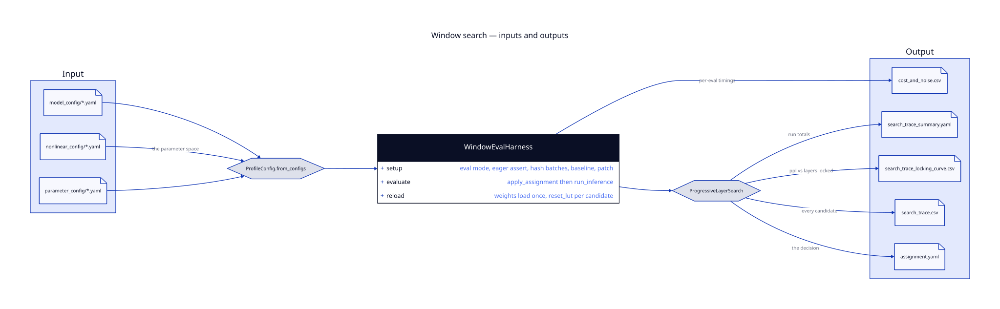

# Inputs and Outputs

This guide documents exactly what the per-layer window search consumes and what it
produces. If you are integrating with this framework from the runtime side, this is the
contract.

---

## 1. At a Glance

<div align="center">
  
</div>

---

## 2. Input — Three YAML Files

The search takes the **same three configs the existing pipeline already takes**. Nothing new
is introduced at the front end.

```bash
python run_window_search.py \
  --model_config     config/model_config/llama/llama_2_7b.yaml \
  --nonlinear_config config/nonlinear_config/nonlinear_config.yaml \
  --parameter_config config/parameter_config/<...>.yaml \
  --mode search
```

| File | Carries |
|---|---|
| `model_config` | which model, where the weights are |
| `nonlinear_config` | which approximation family, and the parameter space |
| `parameter_config` | batch count, sequence length, dataset |

All three are required. They are merged by `ProfileConfig.from_configs`.

### The Parameter Space

The third block of `nonlinear_config` looks like the search space, and it is worth being
precise about the fact that it **is not**:

```yaml
params:
  vlp:
    attention:
      exp_dim:     [8, 9, 10, 11, 12]
      max_exp:     [-4, -3, -2, -1, 0, 1, 2, 3, 4]
      min_exp:     [-4]
      window_size: [256]
      lut_build:   ['max']
```

Values are **lists** here. This is the **published sweep** — the grid the original
`loop_configuration()` walks, applying one setting to all 32 layers. `ProfileConfig` stores
`nonlinear_dict` wholesale and hands it to the model class, which uses it to decide which
approximation family to patch in.

**The per-layer search does not read these lists.** Its candidate space comes from three
other places:

| What | Where it comes from |
|---|---|
| Anchor placements | `DEFAULT_MAX_ANCHORS = (0..7)` and `DEFAULT_MIN_ANCHORS = (-7..0)`, hardcoded in `search.py` |
| Window widths | the `--exp_dims` flag, or the seed's width if unset |
| Neighbourhood limit | the `--radius` flag |
| Starting window | `--exp_dim / --anchor / --anchor_side / --group_size`, or `HistogramSeeder` |

So editing `max_exp:` in the YAML will not change what the search tries. If you want to
change the anchor range you have to edit the constants in `profiling_api/search.py`. That
is worth knowing before someone spends an afternoon tuning a config that has no effect.

There is a second form of this file that the runtime **already supports** —
`layer_config: True`, where `params` is keyed by layer index and the values are scalars.
Hold onto that; it is the whole answer to the compiler-stack question in
[Runtime Integration](RUNTIME_INTEGRATION.md).

### Optional Input — Exponent Histograms

If you pass `--profile_root`, the search seeds each layer's starting window from measured
exponent histograms rather than from a fixed default:

```bash
--profile_root distribution/llama_2_7b
```

`HistogramSeeder` looks for `layer_<n>/seq_len_<m>.pt` under the profiling tree. When a
layer's histogram is missing or unreadable it falls back to a default window and **records
why** — the reason is written into the seed table, not swallowed. At startup the run prints:

```
seeded 27/32 layers from histograms, 5 from fallback
```

---

## 3. Output — Five Artifacts

A search run writes five files. Paths are controlled by `--assignment_out`, `--trace_out`
and `--out`.

### `assignment.yaml` — The Decision

One window per layer per site, plus a digest:

```yaml
window_assignment:
  '0':
    attention: {exp_dim: 10, anchor: 2, anchor_side: max, group_size: 256}
    ffn:       {exp_dim: 10, pos_anchor: 2, neg_anchor: 2, group_size: 256}
  '1':
    attention: {exp_dim: 10, anchor: 1, anchor_side: max, group_size: 256}
    ffn:       {exp_dim: 10, pos_anchor: 2, neg_anchor: 2, group_size: 256}
digest: 9f2a1c4e8b37d051
```

Two things to note:

**The digest is a reproducibility check, not decoration.** It is a SHA-256 prefix over the
assignment. `--mode replay` reloads the file, re-evaluates, and verifies the perplexity
matches what was claimed:

```bash
python run_window_search.py ... --mode replay \
  --assignment output/window_search/assignment.yaml \
  --expect_ppl 5.981 --tolerance 0.001
```

**Only the attention windows vary.** The FFN entry is the same object on every layer — the
search tunes softmax per layer and leaves SiLU uniform. See
[The Search](SEARCH.md).

### `search_trace.csv` — The Audit Trail

One row per candidate evaluated, including the rejected ones:

| Column | Meaning |
|---|---|
| `layer`, `site`, `order` | which candidate, in evaluation order |
| `anchor`, `anchor_side`, `exp_dim`, `group_size` | the window tried |
| `ppl`, `ppl_repeats` | the score, and each repeat if `--search_repeats > 1` |
| `accepted` | whether it replaced the incumbent |
| `delta_vs_incumbent` | previous score minus this score |
| `paired_ci_low`, `paired_ci_high` | reserved for an alternate acceptance mode; empty by default |
| `assignment_hash` | the digest of the full assignment at that point |
| `wall_s`, `apply_ms` | evaluation time, and time spent in `reset_lut` |

A rejected candidate and the reason it was rejected are both recoverable from this file.

### `search_trace_locking_curve.csv` — Perplexity vs Layers Locked

Written automatically alongside the trace. One row per layer as it is frozen:

| Column | Meaning |
|---|---|
| `n_locked` | how many layers have been decided |
| `layer` | which layer was just frozen (`None` for the seed row) |
| `ppl` | incumbent perplexity at that point |
| `improvement_vs_seed`, `step` | cumulative and per-layer gain |
| `changed` | whether this layer's window actually moved |
| `cumulative_evals`, `cumulative_wall_s` | running cost |

> This curve is **monotone by construction**. `ProgressiveLayerSearch` tracks the incumbent
> as a running minimum across layers (`incumbent = min(incumbent, outcome.best_ppl)`), so it
> cannot go up. A smooth descending curve is partly a property of the bookkeeping rather
> than evidence of steady per-layer gains — worth stating whenever the curve is shown.

### `search_trace_summary.yaml` — Run Totals

Baseline perplexity, seed perplexity, final perplexity, layers changed, evaluation count,
wall time, stop reason per layer, and the locking curve inline.

### `cost_and_noise.csv` — Per-Evaluation Timings

Written by the harness rather than the search. One row per evaluation with wall time, GPU
time, peak memory, input hash and full provenance (torch version, transformers version,
CUDA, device count).

---

## 4. Provenance

Every evaluation records what produced it:

```python
{'torch': ..., 'transformers': ..., 'python': ..., 'cuda': ...,
 'n_devices': ..., 'function_name': 'vlp', 'profiling': 'off', 'model': ...}
```

`input_hash` additionally fingerprints the evaluation batches, so two runs can be compared
only when they measured the same thing.

---

## 5. A Correctness Guard Worth Knowing About

Before any of this runs, `WindowEvalHarness.setup()` asserts that the model was loaded with
eager attention:

```python
if impl is not None and impl != 'eager':
    raise RuntimeError(...)
```

The reason is in the error message: the patched attention forward only routes through the
LUT when the implementation is `'eager'`. Loaded any other way, **every softmax window would
be silently ignored and the perplexities would look plausible but measure nothing.** This
guard exists to make that failure loud.

---

Next: [Runtime Integration](RUNTIME_INTEGRATION.md) — how the output reaches the runtime.
