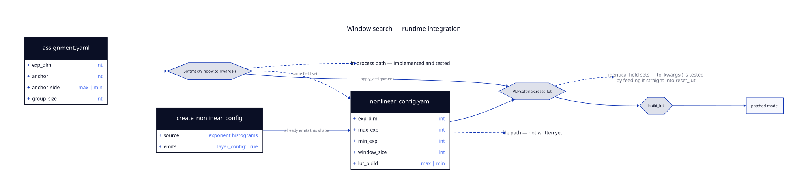

# Runtime Integration

This guide answers one question directly:

> **How does the search's output translate to the runtime code, and do we need an additional
> compiler stack?**

Short answer: **no compiler stack.** The output lands in a schema the runtime already reads.
The rest of this guide is the evidence.

---

## 1. The Path

<div align="center">
  
</div>

---

## 2. Why the Search Stores an Anchor

The search's internal representation looks different from the runtime's, and it is worth
explaining rather than glossing over, because it looks like a mismatch and is not.

A window is a band of `exp_dim` consecutive exponents. You can name that band by either
end — the other end follows. `anchor` plus `anchor_side` records **which end is the fixed
reference**.

This matters because the runtime derives one end from the other. In
`custom_nonlinear/custom_nonlinear_functions/vlp_softmax_approx.py`:

```python
def build_lut(self):
    if self.lut_build == "max":
        self.min_exp = self.max_exp - (self.exp_dim - 1)
    else:
        self.max_exp = self.min_exp + (self.exp_dim - 1)
```

So for a max-anchored layer, whatever you pass as `min_exp` is **overwritten**. It carries
no information. Encoding the band as `(anchor, anchor_side)` keeps the search space honest:
there is no coordinate that silently does nothing.

`SoftmaxWindow` exposes the derived ends as properties, so both views are always available:

```python
w = SoftmaxWindow(exp_dim=10, anchor=2, anchor_side='max')
w.max_exp   # 2
w.min_exp   # -7
w.covers    # range(-7, 3)
```

---

## 3. The Translation

`to_kwargs()` expands the anchor form back into the runtime's naming:

```python
def to_kwargs(self) -> dict:
    return dict(
        exp_dim=self.exp_dim,
        max_exp=self.max_exp,
        min_exp=self.min_exp,
        window_size=self.group_size,
        lut_build=self.anchor_side,
    )
```

That is the entire conversion. No lowering, no intermediate representation, no code
generation.

---

## 4. The Field Sets Are Identical

This is the part to show Greg.

### Attention

| The search emits (`SoftmaxWindow.to_kwargs`) | The runtime emits (`attention_params`) |
|---|---|
| `exp_dim` | `exp_dim` |
| `max_exp` | `max_exp` |
| `min_exp` | `min_exp` |
| `window_size` | `window_size` |
| `lut_build` | `lut_build` |

### FFN

| The search emits (`FfnWindow.to_kwargs`) | The runtime emits (`ffn_params`) |
|---|---|
| `exp_dim` | `exp_dim` |
| `max_pos_exp` | `max_pos_exp` |
| `max_neg_exp` | `max_neg_exp` |
| `window_size` | `window_size` |

Both sides match exactly. And this is not luck — `attention_params` and `ffn_params` in
`profile_distribution.py` are the constructor arguments of `VLPSoftmax` and `VLPSilu`. The
search targets the same constructors.

---

## 5. Why There Is No New Stack

`create_nonlinear_config` in `profile_distribution.py` has **always** emitted per-layer
parameters, derived from exponent histograms:

```python
nonlinear_dict = {
    'layer_config': True,
    'functions': {'vlp': {'attention': ['softmax'],
                          'ffn': ['gelu', 'silu', 'fast_gelu']}},
    'params': {}      # keyed by layer index
}
```

The runtime already reads per-layer windows under `layer_config: True`. The search produces
the same object.

**What changed is how the numbers are chosen — measured perplexity instead of a histogram
heuristic — not what a window is or how it is expressed.**

That is the whole answer. There is no new IR, no lowering step, and no new artifact type.
The search is choosing values for a config that already exists.

---

## 6. What Is Actually Tested

Being precise here, because it matters for how much weight the claim can carry.

**Tested:** `to_kwargs()` fed straight into the runtime entry point. From
`tests/test_reset_lut.py`:

```python
reset.reset_lut(**target.to_kwargs())
```

If `to_kwargs()` and `reset_lut`'s signature ever diverge, that test fails. The **call
signature correspondence is exercised directly**, which is the strongest form of this check.

**Also tested:** the FFN config key set, pinned by exact set equality in
`tests/test_nonlinear_config_emission.py`:

```python
assert set(params['vlp']['ffn']) == {
    'exp_dim', 'max_pos_exp', 'max_neg_exp', 'window_size'}
```

**Not tested:** `to_kwargs()` against `create_nonlinear_config`'s YAML output. Both sides are
pinned independently and they happen to agree. Nothing would fail if someone changed one and
not the other.

---

## 7. The Gap

Right now the translation lives **inside the harness**. `apply_assignment` calls
`to_kwargs()` and patches the live model:

```python
def _reset(obj, window, layer, site):
    reset_lut = getattr(obj, 'reset_lut', None)
    if reset_lut is None:
        raise TypeError(...)
    reset_lut(**window.to_kwargs())
```

Nothing yet writes `assignment.yaml` back out as a `nonlinear_config.yaml` on disk.

So: the conversion is implemented and tested, but only on the in-memory path. Standing it up
as a file-to-file emitter is roughly fifteen lines — a loop over the assignment calling the
existing `to_kwargs()`, wrapped in the `layer_config: True` envelope:

```python
def assignment_to_nonlinear_config(assignment):
    params = {}
    for layer, site, window in assignment.items():
        params.setdefault(str(layer), {'vlp': {}})['vlp'][site] = window.to_kwargs()
    return {'layer_config': True,
            'functions': {'vlp': {'attention': ['softmax'],
                                  'ffn': ['gelu', 'silu', 'fast_gelu']}},
            'params': params}
```

Until that lands, the in-process path is the only way to consume an assignment.

---

## 8. Summary for a Consumer

If you are writing the runtime side, what you need to know is:

1. You will receive a per-layer window assignment.
2. It goes into the `layer_config: True` path you already have.
3. The field names are the ones you already use.
4. Until the file emitter lands, the only way to consume it is in-process via
   `apply_assignment(host, WindowAssignment.from_yaml(path))`.

---

Next: [The Window Model](WINDOW_MODEL.md) — what a window actually is.
