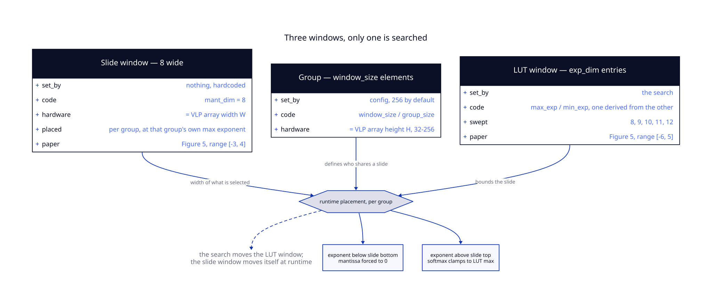

# The Window Model

The word "window" means three different things in this codebase. Confusing them is the most
common way to misread what the search does, so this guide separates them.

> **The short version:** the search picks where the *LUT window* lives. An 8-wide *slide
> window* positions itself inside it at runtime, per group. The search never touches the
> slide.

---

## 1. The Three Windows

<div align="center">
  
</div>

| Name in code | What it is | Who sets it |
|---|---|---|
| `exp_dim` | **LUT window** — depth of the static lookup table | **the search** |
| `mant_dim = 8` | **Slide window** — width of what is selected per group | hardcoded, never varies |
| `window_size` / `group_size` | **Group** — how many elements share one slide | config, 256 by default |

These map directly onto the hardware. From Table 2 of the ASPLOS paper:

- **Array width (W) = 8** — this is the slide window
- **Array height (H) = 32–256** — this is `window_size`

### A naming collision to watch for

The name `window_size` is used for **two different quantities** in this codebase:

| Where | Value | Means |
|---|---|---|
| `ProfileConfig.window_size` | 8 | the **slide** width |
| `SoftmaxWindow.to_kwargs()['window_size']` | 256 | the **group** height |

`ProfileConfig` also carries `lut_window_size = 32`, plus `lut_height = 8`,
`lut_width = 12` and `window_width = 8` for the archx emitter. The two paths never exchange
the field, so nothing is broken — but read the struct before you read the name.

And onto Figure 5, which shows a LUT window of `[−6, 5]` with a slide window of `[−3, 4]`
sitting inside it.

---

## 2. What Actually Happens at Runtime

This is the part that is easy to get wrong. The LUT window does **not** clamp values
directly. From `vlp_softmax_approx.py`:

```python
max_exp_window = torch.max(exp, dim=0, keepdim=True)[0].expand_as(exp)
max_exp_window = torch.where(max_exp_window > self.max_exp, self.max_exp, max_exp_window)
min_exp_window = max_exp_window - (self.mant_dim - 1)
min_exp_window = torch.where(min_exp_window < self.min_exp, self.min_exp, min_exp_window)
```

Read that in order:

1. Take the **maximum exponent within this group** of `window_size` elements.
2. Cap it at the configured `max_exp` — this is the only point where the LUT window bites.
3. Lay an **8-wide band below it**: `min_exp_window = max_exp_window - 7`.
4. Floor that at the configured `min_exp`.

Then values are clamped into `[min_exp_window, max_exp_window]` — the **slide**, not the LUT
window.

So the slide window tracks the data. It re-positions itself for every group of 256 elements,
and only bumps into the LUT window's edges when the group's own dynamic range exceeds what
the table covers.

The paper describes exactly this: *"we opt for a sliding window for each mapping and choose
an optimal range"* (§3.3).

---

## 3. What Overflow and Underflow Do

Once the slide is placed, values outside it are handled by saturating the mantissa:

```python
mant_window_max = torch.where(exp <= max_exp_window, mant, self.mant_dim - 1)
mant_window     = torch.where(exp_window_max >= min_exp_window, mant_window_max, ..., 0)
```

- **Above the slide** — mantissa forced to `mant_dim - 1` (7), the top of the table. For
  softmax the paper describes this as clamping to the LUT's maximum value.
- **Below the slide** — mantissa forced to `0`, which flushes toward zero.

Padding uses sentinel exponents (`-1000` for max-anchored, `+1000` for min-anchored) so that
padded lanes never influence the group's maximum.

---

## 4. Attention vs FFN

The two sites use different window types because the underlying functions differ.

### `SoftmaxWindow` — one band

```python
SoftmaxWindow(exp_dim=10, anchor=2, anchor_side='max', group_size=256)
```

Softmax inputs are all negative (the maximum is subtracted for numerical stability), so one
band suffices. `anchor_side` selects which end is authoritative.

### `FfnWindow` — two bands

```python
FfnWindow(exp_dim=10, pos_anchor=2, neg_anchor=2, group_size=256)
```

SiLU takes both positive and negative inputs, so `VLPSilu` builds **two** lookup tables —
`build_pos_lut()` and `build_neg_lut()` — each `exp_dim × 8`. The paper notes this directly:
*"The LUT size will double if the nonlinear operation has both positive and negative
inputs."*

Both FFN anchors are max-style; each derives its own minimum:

```python
self.pos_min_exp = self.max_pos_exp - (self.exp_dim - 1)
self.neg_min_exp = self.max_neg_exp - (self.exp_dim - 1)
```

There is no `lut_build` for the FFN — `FfnWindow.to_kwargs()` deliberately omits it, and a
test asserts the omission.

---

## 5. Why This Matters for the Search

Three consequences follow from the model above:

**The search has less leverage than it appears.** It moves the LUT window's ceiling. The
slide — which is what actually determines precision for a given group — positions itself.
The search only changes outcomes for groups whose dynamic range pushes against the LUT
window's edges.

**`exp_dim` and `anchor` interact.** Widening the LUT window while holding the anchor fixed
extends it *downward* (`min_exp = anchor − (exp_dim − 1)`), which changes which groups
underflow but not which overflow.

**`group_size` is a lever nobody is pulling.** A smaller group means the slide tracks the
data more tightly, because fewer elements share one placement. It is fixed at 256 in the
current configs and is not part of the search space, even though Table 2 lists 32–256 as the
supported range.

---

Next: [The Search](SEARCH.md) — how candidates are chosen and frozen.
